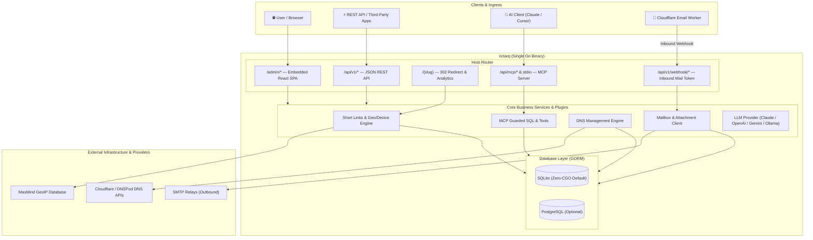

# Octarq — Link, Email & Domain Management in One Binary

[](https://github.com/octarq-org/octarq/actions/workflows/ci.yml)
[](https://github.com/octarq-org/octarq/actions/workflows/release.yml)
[](go.mod)
[](LICENSE)
[](https://modelcontextprotocol.io)

[English](README.md) | [简体中文](README_ZH.md)

**Octarq** is an open-source, self-hosted **Short Link, Mailbox, and DNS Management** platform shipped as a **single Go binary** with an embedded modern React dashboard.

Octarq consolidates domain infrastructure, URL shortening, disposable email routing, DNS automation, and AI integration into a unified, zero-dependency solution.

---

## 🌟 Key Features

### 🔗 Short Links & Dynamic Routing
- **Custom & Random Slugs**: Pick hosts from your link-enabled custom domains.
- **Advanced Target Rules**: Route visitors dynamically based on **Geo Country/Region**, **Device**, **OS**, and **Browser Language**.
- **Lifecycle Control**: Set expiration times, **expired-URL fallbacks**, and total **click limits**.
- **Analytics & Bot Detection**: Detailed time-series graphs, top referrers, device/browser distributions, and country maps powered by optional MaxMind GeoIP.
- **Marketer Tools**: Built-in **UTM Builder**, 1-click **destination title fetch**, QR code generation, tags, and link archiving.

### ✉️ Mailboxes & Email Routing
- **Serverless Inbound Mail**: Receive incoming mail via Cloudflare Email Routing Workers without managing SMTP port 25 or spam daemons.
- **Catch-All & Auto Creation**: Automatically provision mailboxes when mail arrives on configured domains.
- **Full Email Client**: Read emails, view attachment lists, download raw `.eml` files, reply to messages, and send outbound emails via multiple configured SMTP relays.
- **AI Mail Summarization**: On-demand AI summaries for inbox messages (BYO key for Anthropic Claude, OpenAI, Gemini, Mistral, Cohere, or local Ollama).

### 🌐 DNS Management
- **One-Click Sync**: Manage Cloudflare zones and DNS records with full CRUD operations.
- **Multi-Provider Architecture**: Built-in Cloudflare and DNSPod support; extensible provider interface for AWS Route53 and Aliyun DNS.
- **Subdomain Presets**: Quick-apply presets for short link setup and email authentication (MX/SPF/DKIM).
- **Native Notes Mapping**: Sync record notes directly to provider-native comment/remark fields.

### 🤖 Native AI & MCP Server (`octarq mcp`)
- **Built-in MCP Server**: Exposes Model Context Protocol tools over `stdio` and `SSE`/`stream` endpoints for AI assistants like Claude Code, Claude Desktop, and Cursor.
- **Read-Only AI Tools**: `list_links`, `list_mailboxes`, `list_emails`, `list_domains`, `export_data`.
- **Guarded SQL Tool (`query_db_readonly`)**: Safely allows LLMs to query metrics using read-only SQL execution (`SELECT`/`WITH` only, row-capped, automatic redaction of sensitive columns like password hashes and provider secrets).
- **Multi-LLM Abstraction (`llmprovider`)**: Single unified interface backing Claude 3.7/4.x, OpenAI, Gemini, Mistral, Cohere, and local Ollama endpoints.

### 🏢 Multi-Tenant Workspaces & RBAC
- **Isolated Workspaces**: Multiple organizations with isolated data partitions and seamless workspace switching.
- **Role-Based Access Control**: Enforced server-side roles (`Member < Admin < Owner` with instance admin bypass) mirrored in UI navigation.
- **Onboarding**: Email invitations with a set-password flow (`/admin/invite/accept`) and automatic personal org creation for OAuth sign-ins.
- **Open API Tokens**: Issue SHA-256 hashed Bearer tokens (`Authorization: Bearer led_...`) for external automation.

### 🧩 Plugin-First Modular Architecture
- **Symmetric Architecture**: Every major subsystem is composed of a backend Go plugin (`plugin.Plugin`) and a frontend UI plugin (`UIPlugin` from `@octarq-org/plugin-sdk`).
- **Build-Time Manifest Composition**: Easily add or trim features via `web/octarq.plugins.json` without code forks.
- **Inter-Plugin Service Registry**: Loose coupling using `Context.Provide` and `LookupAs[T]`.
- **Graceful Degradation**: Unlicensed or uncomposed features automatically display user-friendly upsells or neutral status components (`ProGate`).

---

## 🏗️ Architecture



- **Clean Namespace**: The dashboard is served under `/admin` so that short-link slugs (`https://go.example.com/abc`) never collide with admin routes.
- **Host Restriction**: Setting `OCTARQ_ADMIN_HOST` (e.g. `admin.example.com`) isolates the dashboard UI to a designated domain.

---

## 🚀 Quick Start

### Option 1: Run with Docker Compose (Recommended)

```bash
# 1. Clone repository
git clone https://github.com/octarq-org/octarq.git
cd octarq

# 2. Configure environment
cp .env.example .env
# Edit .env to set OCTARQ_SECRET_KEY and OCTARQ_ADMIN_PASSWORD

# 3. Start service
docker compose up -d
```

Open `http://localhost:8080` (redirects to `/admin`) and log in with your configured admin credentials.

### Option 2: Build & Run from Source

**Prerequisites**: Go 1.25+, Node.js 20+, pnpm 9+

```bash
# 1. Clone repository and set up environment
cp .env.example .env

# 2. Build web assets & compile binary
make release

# 3. Start the binary
./octarq
```

### Ultra-lightweight Docker Image (~19MB)

If you build web assets ahead of time (`make web`), you can create a minimal `scratch` docker container:

```bash
docker build -f deploy/Dockerfile.binary -t octarq:latest .
```

---

## 🤖 AI & Model Context Protocol (MCP)

Octarq comes with a built-in MCP server that enables AI assistants (such as Claude Code, Claude Desktop, Cursor) to inspect and query your self-hosted instance.

### Running MCP Stdio Server

```bash
octarq mcp
```

### Claude Desktop Integration

Add the following to your `claude_desktop_config.json`:

```json
{
  "mcpServers": {
    "octarq": {
      "command": "/path/to/octarq",
      "args": ["mcp"],
      "env": {
        "OCTARQ_DB_PATH": "/path/to/octarq.db"
      }
    }
  }
}
```

---

## 📧 Email Receiving via Cloudflare Worker

Octarq delegates email ingress to Cloudflare Email Routing:

1. Enable **Email Routing** for your domain in the Cloudflare Dashboard.
2. Deploy [`deploy/cloudflare-email-worker.js`](deploy/cloudflare-email-worker.js) as a Cloudflare Worker.
3. Configure `OCTARQ_ENDPOINT` (e.g., `https://your-octarq-domain.com`) and `OCTARQ_TOKEN` (matching the Inbound Token set in Octarq Settings).
4. Set a catch-all route pointing to your deployed Worker.
5. In Octarq Dashboard, enable **Accept email** for your domain.

---

## 🌍 GeoIP Analytics Setup

To enable country, region, and city breakdowns in link analytics:

Set **`OCTARQ_MAXMIND_LICENSE_KEY`** (a free key from maxmind.com) in your `.env`. Octarq will automatically download, sha256-verify, and hot-load the GeoLite2 database on startup.

For offline environments or custom databases, set `OCTARQ_GEOIP_DB=/path/to/GeoLite2-City.mmdb`. See [`deploy/GEOIP.md`](deploy/GEOIP.md) for detailed options.

---

## 🧩 Extensibility & Custom Plugins

Octarq's plugin model lets developers build full-stack extensions without touching core code:

1. **Backend Plugin**: Create a Go package implementing `plugin.Plugin`.
2. **Frontend UI Plugin**: Use `@octarq-org/plugin-sdk` to build React pages and components.
3. **Manifest Injection**: Register your UI plugin in `web/octarq.plugins.json`.

See [`docs/PLUGINS.md`](docs/PLUGINS.md) for step-by-step instructions and check [`examples/plugin-hello`](examples/plugin-hello) for a complete example plugin.

---

## 🛠️ Development

```bash
# Terminal 1: Run Go backend API on :8080
OCTARQ_SECRET_KEY=dev OCTARQ_ADMIN_PASSWORD=dev go run .

# Terminal 2: Run Vite frontend dev server with hot reload (proxies /api -> :8080)
make dev
```

### Running Tests

```bash
go test ./... -race
pnpm --filter @octarq-org/plugin-sdk test
```

---

## 💖 Credits

Octarq's development and design were inspired by and built upon ideas from these excellent open-source projects:

- [sink](https://github.com/ccbikai/sink) — Simple, fast, and feature-rich link shortener.
- [wr.do](https://github.com/oiov/wr.do) — Minimalist short link and email routing design.
- [dub](https://github.com/dubinc/dub) — Open-source link management infrastructure.

---

## 📄 License

This project is licensed under the [MIT License](LICENSE).
