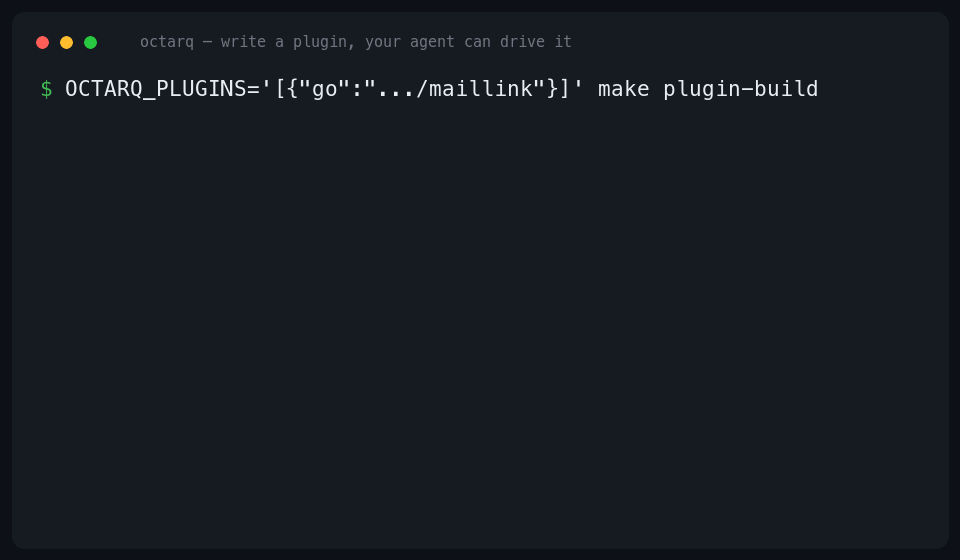

# Octarq — the self-hosted back office for one-person companies & AI-native teams

[](https://github.com/octarq-org/octarq/actions/workflows/ci.yml)
[](LICENSE)
[](https://modelcontextprotocol.io)

[English](README.md) | [简体中文](README_ZH.md)

**Octarq is a single Go binary you extend with plugins** — the self-hosted operations backend for indie hackers, one-person companies, and small AI-native teams.

Own a domain? Octarq already gives you the things you'd otherwise wire together from three SaaS bills: **short links with analytics, inbound/outbound email, and DNS automation** — each shipped as a first-class plugin, not a locked-in feature. Then you extend it the same way its own core is built: **a small Go interface + a React page = a new tool in your back office.** And because Octarq speaks **MCP**, every plugin you add is instantly drivable by your AI agent (Claude Code, Cursor, Claude Desktop).

> One binary. No CGO. SQLite by default. `go:embed`'d dashboard. Extend without forking.

<p align="center">
  
</p>

---

## Why Octarq

Think of it as the intersection of three tools you already know:

- **PocketBase's** single-binary, extend-in-an-afternoon developer experience —
- applied to **Dub-style** links + real domain/email/DNS infrastructure —
- with an **n8n-style** plugin ecosystem for connectors (Telegram, Webhooks, SMS, …) —
- and every capability is **agent-native over MCP**.

Octarq isn't a URL shortener that also does email. It's a **framework**: links/email/DNS are the reference plugins that prove the model, and the ecosystem grows toward whatever a one-person company needs to self-host next.

---

## Batteries included (the reference plugins)

These ship in the default build so Octarq is useful on minute one:

- **🔗 Links** — custom/random slugs, geo/device/OS/language routing, expiration & click limits, expired-URL fallbacks, time-series analytics with bot detection, UTM builder, QR codes, tags (optional MaxMind GeoIP).
- **✉️ Mail** — serverless inbound mail via Cloudflare Email Routing (no port 25, no spam daemons), catch-all auto-provisioning, a full client (read/reply/send over your SMTP relays, download raw `.eml`), on-demand AI summaries (BYO key).
- **🌐 DNS** — Cloudflare & DNSPod CRUD, subdomain presets for short-link + email auth (MX/SPF/DKIM), native comment/notes mapping.
- **🏢 Workspaces & RBAC** — isolated multi-tenant orgs, server-enforced roles, invite/onboarding, hashed Bearer API tokens.

Every one of these is a `plugin.Plugin` + `UIPlugin` — the exact same seam your own plugins use.

---

## Agent-native: your plugin is an MCP tool

Octarq ships a built-in **MCP server** (`octarq mcp`, over stdio and SSE/stream) so assistants like Claude Code can read and query your instance — `list_links`, `list_mailboxes`, `list_domains`, `export_data`, plus a **guarded read-only SQL tool** (`SELECT`/`WITH` only, row-capped, secrets auto-redacted).

The point isn't "we added AI." The point is the **framework** wiring: a plugin that implements the optional `MCPProvider` interface exposes its own tools to every connected agent — no extra plumbing. Write a plugin, and your AI agent can drive it.

```
📬 New OTP email arrives ──▶ your 10-line plugin (OnEmail hook)
                              ├─ generates a short link (links service)
                              └─ exposes it as an MCP tool ──▶ Claude Code consumes it
```

---

## Quick start

Zero config — one command, no `.env`:

```bash
docker run -p 8080:8080 -v octarq-data:/data octarq/octarq
```

On first boot Octarq generates a secret key and an initial `admin` password (both persisted under `/data`, printed once in the logs) and comes up on SQLite. Open `http://localhost:8080`, grab the password from the container logs, and log in. Mail, DNS and GeoIP are all opt-in — configure them later from **Settings**, nothing is required to start.

That's the full stack — dashboard, API, redirector, MCP — in one container. Set `OCTARQ_SECRET_KEY` / `OCTARQ_ADMIN_PASSWORD` explicitly (see `.env.example` + `docker compose`) whenever you want to manage them yourself.

Prefer a ~19MB `scratch` image or from-source build? See `make release` and [`deploy/`](deploy/).

---

## Extend it (write a plugin)

A plugin is one repo with two mirror halves, composed **at build time** (like `xcaddy` — pick your plugins, build a binary):

```go
// backend: implement a 3-method interface, get DB/auth/audit/DNS/mail/cache for free
func (Plugin) Name() string          { return "hello" }
func (Plugin) Models() []any         { return nil }
func (Plugin) Mount(mux plugin.Mux, ctx *plugin.Context) {
    mux.Handle("GET /api/hello/ping", ctx.Guard(http.HandlerFunc(pong)))
}
```

```ts
// frontend: a React page from the shared SDK — matches the app, a11y for free
export const helloPlugin: UIPlugin = {
  name: "hello",
  routes: [{ path: "/hello", Component: lazy(() => import("./Page")) }],
  menu:  [{ id: "hello", label: "Hello", path: "/hello", icon: "👋", category: "Workspace" }],
};
```

- **Never fork, never import `internal/*`** — everything is on `plugin.Context` (DB, Guard, Encrypt, Audit, Notify, SendMail, OnEmail, DNS, cache, geo, webhooks, job queue…), evolved additive-only.
- **Routes auto-gate** (404 when disabled), **plugins talk via a service registry** (no cross-imports), **models auto-migrate**.
- **Compose a custom binary without editing code** — the xcaddy model:
  ```bash
  OCTARQ_PLUGINS='[{"go":"github.com/you/octarq-plugin-foo","npm":"@you/octarq-plugin-foo"}]' make plugin-build
  ```

**Scaffold one in seconds** — `octarq plugin new <name>` writes a buildable Go + web skeleton to start from.

**Official plugins & starter template** → [octarq-plugins](https://github.com/octarq-org/octarq-plugins) (Telegram, Webhook, the agent-native Mail Links demo, and a `_template` to copy) · **Guide** → [docs/PLUGINS.md](docs/PLUGINS.md)

*Octarq's own Pro edition is just another set of plugins built against this same public interface — nothing the community can't do.*

---

## Setup guides

- **Email via Cloudflare Worker** — deploy [`deploy/cloudflare-email-worker.js`](deploy/cloudflare-email-worker.js), set a catch-all route, enable *Accept email*.
- **GeoIP analytics** — set `OCTARQ_MAXMIND_LICENSE_KEY` (free) and Octarq auto-downloads + hot-loads GeoLite2. See [`deploy/GEOIP.md`](deploy/GEOIP.md).
- **MCP in Claude Desktop** — point `claude_desktop_config.json` at `octarq mcp`.

<details>
<summary>Claude Desktop MCP config</summary>

```json
{ "mcpServers": { "octarq": {
  "command": "/path/to/octarq", "args": ["mcp"],
  "env": { "OCTARQ_DB_PATH": "/path/to/octarq.db" }
}}}
```
</details>

---

## Development

```bash
OCTARQ_SECRET_KEY=dev OCTARQ_ADMIN_PASSWORD=dev go run .   # backend :8080
make dev                                                  # Vite frontend, proxies /api
go test ./... -race
```

---

## Credits

Inspired by and built on ideas from
- [sink](https://github.com/ccbikai/sink),
- [wr.do](https://github.com/oiov/wr.do),
- [dub](https://github.com/dubinc/dub),

and the DX bar set by
- [PocketBase](https://github.com/pocketbase/pocketbase).

## License

[MIT](LICENSE). The framework stays permissive; the commercial edition is a private set of plugins on top.
