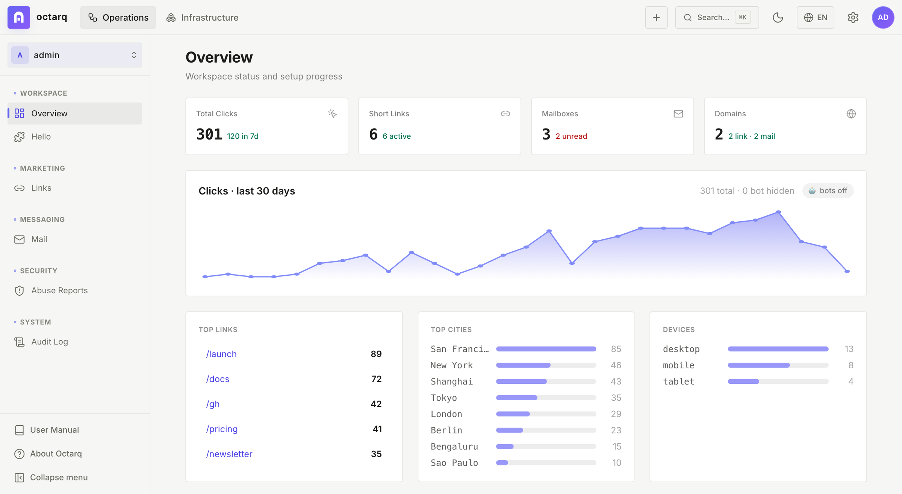
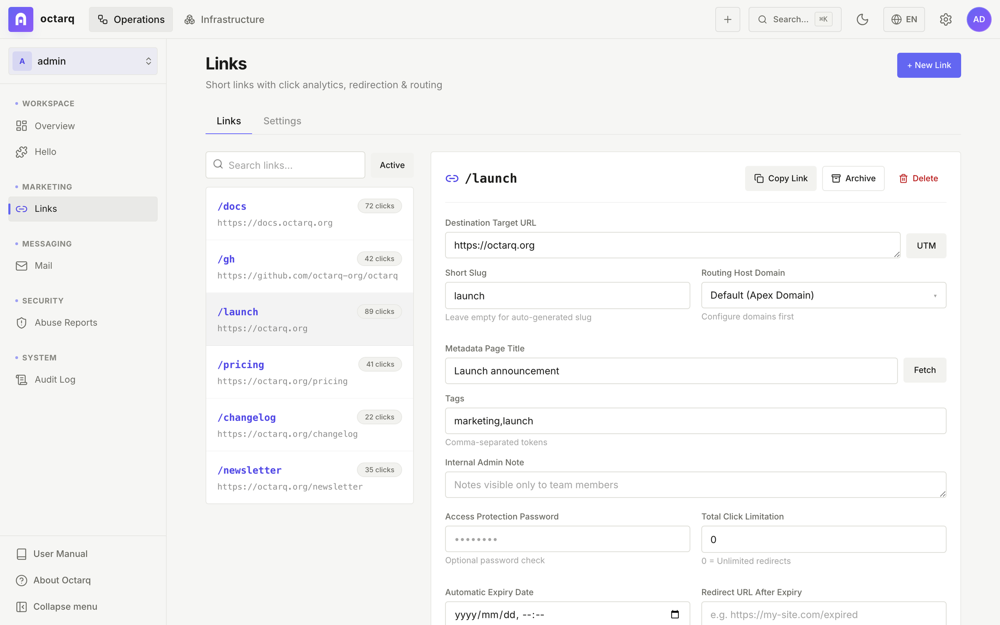
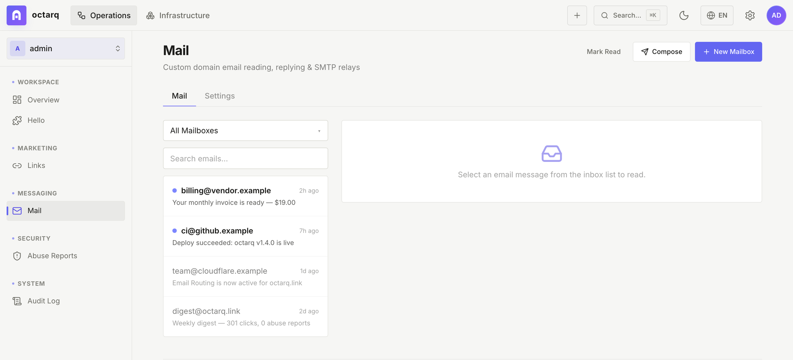
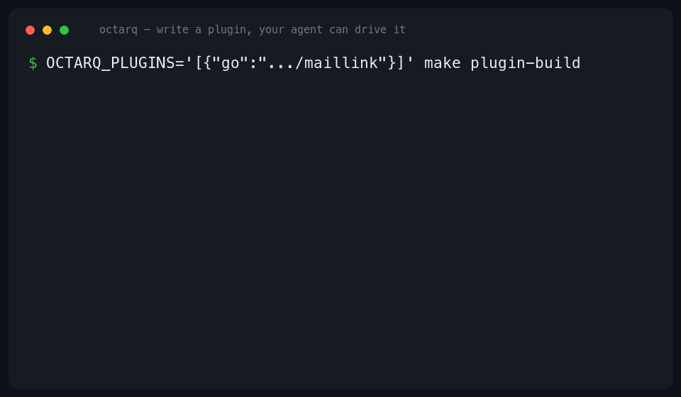

<p align="center">
  <picture>
    <source media="(prefers-color-scheme: dark)" srcset="assets/banner-dark.png">
    
  </picture>
</p>

<p align="center">
  <b>One Go binary. Short links, email and DNS included. Extend it with plugins — and drive all of it from your AI agent over MCP.</b>
</p>

<p align="center">
  <a href="https://github.com/octarq-org/octarq/actions/workflows/ci.yml"></a>
  <a href="https://github.com/octarq-org/octarq/actions/workflows/ci.yml"></a>
  <a href="go.mod"></a>
  <a href="https://pkg.go.dev/github.com/octarq-org/octarq"></a>
  <a href="https://modelcontextprotocol.io"></a>
</p>

<p align="center">
  <a href="https://octarq.org">Website</a> ·
  <a href="https://docs.octarq.org">Docs</a> ·
  <a href="#quick-start">Quick start</a> ·
  <a href="#extend-it-write-a-plugin">Write a plugin</a> ·
  <a href="https://github.com/octarq-org/octarq-plugins">Plugins</a> ·
  <a href="README_ZH.md">简体中文</a>
</p>

---

## What is Octarq?

Octarq is the **self-hosted operations backend for indie hackers, one-person companies, and small AI-native teams** — the back office you'd otherwise assemble from three SaaS subscriptions.

Own a domain? Octarq already gives you **short links with analytics, inbound/outbound email, and DNS automation** — each shipped as a first-class plugin, not a locked-in feature. Then you extend it the same way its own core is built: **a small Go interface + a React page = a new tool in your back office.** And because Octarq speaks **MCP**, every plugin you add is instantly drivable by your AI agent (Claude Code, Cursor, Claude Desktop).

> One binary. No CGO. SQLite by default. `go:embed`'d dashboard. Extend without forking.

<p align="center">
  
</p>

---

## Quick start

Zero config — one command, no `.env`:

```bash
# Production zero-config (auto-generates secret key & admin password):
docker run -p 8080:8080 -v octarq-data:/data ghcr.io/octarq-org/octarq:latest

# Or instant local eval (log in immediately with admin / admin):
docker run -p 8080:8080 -e OCTARQ_SECRET_KEY=dev -e OCTARQ_ADMIN_PASSWORD=admin -v octarq-data:/data ghcr.io/octarq-org/octarq:latest
```

On first boot without environment variables, Octarq generates a secret key and an initial `admin` password (both persisted under `/data`, printed once in the logs) and comes up on SQLite. Open `http://localhost:8080`, grab the password from the container logs (or use `admin` if specified above), and log in. Mail, DNS and GeoIP are all opt-in — configure them later from **Settings**, nothing is required to start.

That's the full stack — dashboard, API, redirector, MCP — in one container.

<details>
<summary>Prefer to build from source?</summary>

```bash
git clone https://github.com/octarq-org/octarq && cd octarq
make release                                                # builds ./octarq with the dashboard embedded
OCTARQ_SECRET_KEY=… OCTARQ_ADMIN_PASSWORD=… ./octarq        # serves on :8080
```

Set `OCTARQ_SECRET_KEY` / `OCTARQ_ADMIN_PASSWORD` explicitly (see `.env.example` + `docker compose`) whenever you want to manage them yourself. A minimal image lives in [`deploy/Dockerfile.binary`](deploy/Dockerfile.binary).
</details>

---

## Why Octarq

- **One binary, one afternoon.** Download it, run it, extend it. No runtime to install, no services to wire together, no CGO.
- **Real infrastructure, not a toy.** Short links with geo/device routing and bot-filtered analytics, custom-domain email you can actually read and reply to, DNS automation against Cloudflare and DNSPod.
- **A framework, not a bundle.** Links, mail and DNS are plugins written against the same public interface you get. Nothing about them is privileged.
- **Agent-native by construction.** Every plugin's capabilities reach your AI agent over MCP without extra plumbing.
- **Yours.** Your server, your database, your domain, MIT-licensed.

---

## Batteries included (the reference plugins)

These ship in the default build so Octarq is useful on minute one:

| Plugin      | What you get                                                                                                                                                                                                                   |
| ----------- | ------------------------------------------------------------------------------------------------------------------------------------------------------------------------------------------------------------------------------ |
| **🔗 Links** | Custom/random slugs, geo/device/OS/language routing, expiration & click limits, expired-URL fallbacks, time-series analytics with bot detection, UTM builder, QR codes, tags (optional MaxMind GeoIP).                         |
| **✉️ Mail**  | Serverless inbound mail via Cloudflare Email Routing (no port 25, no spam daemons), catch-all auto-provisioning, a full client (read/reply/send over your SMTP relays, download raw `.eml`), on-demand AI summaries (BYO key). |
| **🌐 DNS**   | Cloudflare & DNSPod CRUD, subdomain presets for short-link + email auth (MX/SPF/DKIM), native comment/notes mapping.                                                                                                           |

<details>
<summary>See the links and mail plugins in action</summary>

<p align="center">
  
  <br><br>
  
</p>
</details>

Everything else — auth, orgs, audit log, notifications, job queue, webhooks, backups — is core, and available to every plugin you write.

---

## Agent-native: your plugin is an MCP tool

Octarq ships a built-in **MCP server** (`octarq mcp` over stdio; SSE and Streamable HTTP on the server at `/api/mcp/sse` and `/api/mcp/stream`) so assistants like Claude Code can read and query your instance — `list_links`, `list_mailboxes`, `list_domains`, `export_data`. Every tool is read-only and scoped to the caller's own workspace.

The point isn't "we added AI." The point is the **framework** wiring: a plugin that implements the optional `MCPProvider` interface exposes its own tools to every connected agent — no extra plumbing. Write a plugin, and your AI agent can drive it.

```
📬 New OTP email arrives ──▶ your 10-line plugin (OnEmail hook)
                              ├─ generates a short link (links service)
                              └─ exposes it as an MCP tool ──▶ Claude Code consumes it
```

<p align="center">
  
</p>

<details>
<summary>Claude Desktop MCP config</summary>

```json
{ "mcpServers": { "octarq": {
  "command": "/path/to/octarq", "args": ["mcp"],
  "env": { "OCTARQ_DB_DSN": "/path/to/octarq.db" }
}}}
```
</details>

---

## Extend it (write a plugin)

A plugin is one repo with two mirror halves, composed **at build time** (like `xcaddy` — pick your plugins, build a binary):

```go
// backend: implement a 3-method interface, get DB/auth/audit/DNS/mail/cache for free
func (Plugin) Name() string          { return "hello" }
func (Plugin) Models() []any         { return nil }
func (Plugin) Mount(mux plugin.Mux, ctx *plugin.Context) {
    mux.Handle("GET /api/hello/ping", ctx.Guard(http.HandlerFunc(pong)))
}
```

```ts
// frontend: a React page from the shared SDK — matches the app, a11y for free
export const helloPlugin: UIPlugin = {
  name: "hello",
  routes: [{ path: "/hello", Component: lazy(() => import("./Page")) }],
};
```

- **Never fork, never import `internal/*`** — everything is on `plugin.Context` (DB, Guard, Encrypt, Audit, Notify, SendMail, OnEmail, DNS, cache, geo, webhooks, job queue…), evolved additive-only.
- **Routes auto-gate** (404 when disabled), **plugins talk via a service registry** (no cross-imports), **models auto-migrate**.
- **Compose a custom binary without editing code** — the xcaddy model:
  ```bash
  OCTARQ_PLUGINS='[{"go":"github.com/you/octarq-plugin-foo","npm":"@you/octarq-plugin-foo"}]' make plugin-build
  ```

**Scaffold one in seconds** — `octarq plugin new <name>` writes a buildable Go + web skeleton to start from.

**Official plugins & starter template** → [octarq-plugins](https://github.com/octarq-org/octarq-plugins) (Telegram, Webhook, the agent-native Mail Links demo, and a `_template` to copy) · **Guide** → [Writing a plugin](https://docs.octarq.org/writing-a-plugin/)

*Octarq's own Pro edition is just another set of plugins built against this same public interface — nothing the community can't do.*

---

## Setup guides

- **Email via Cloudflare Worker** — deploy [`deploy/cloudflare-email-worker.js`](deploy/cloudflare-email-worker.js), set a catch-all route, enable *Accept email*.
- **GeoIP analytics** — set `OCTARQ_MAXMIND_LICENSE_KEY` (free) and Octarq auto-downloads + hot-loads GeoLite2. See [`deploy/GEOIP.md`](deploy/GEOIP.md).
- **MCP in Claude Desktop** — point `claude_desktop_config.json` at `octarq mcp` (config above).
- **Backup & restore** — `octarq backup` / `octarq restore` back up the database. Back up the whole `/data` directory (database **plus** the generated `octarq.secret` / `octarq-admin-password.txt` key files), and note Postgres backup needs host-side `pg_dump`. See [Backup & restore](https://docs.octarq.org/backup-restore/).

---

## Development

```bash
OCTARQ_SECRET_KEY=dev OCTARQ_ADMIN_PASSWORD=dev go run .   # backend :8080
make dev                                                  # Vite frontend, proxies /api
go test ./... -race
```

Contributions welcome — see [CONTRIBUTING.md](CONTRIBUTING.md).

---

## License

[MIT](LICENSE).
