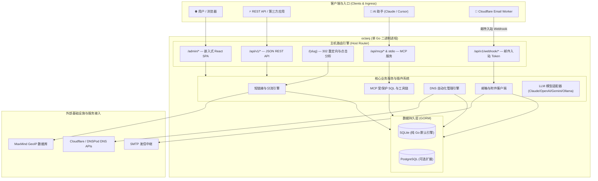

# Octarq — 单文件 Go 架构的短链接、邮箱与 DNS 管理平台

[](https://github.com/octarq-org/octarq/actions/workflows/ci.yml)
[](https://github.com/octarq-org/octarq/actions/workflows/release.yml)
[](go.mod)
[](LICENSE)
[](https://modelcontextprotocol.io)

[English](README.md) | [简体中文](README_ZH.md)

**Octarq** 是一个开源、可自托管的**短链接、临时邮箱与 DNS 自动化管理平台**。采用**单 Go 二进制文件**发布，内部嵌入现代化 React 控制面板。

Octarq 将域名基础设施、短链接分发、临时邮箱路由、DNS 记录自动化以及 AI 原生能力整合为一套统一、零外部依赖的开箱即用解决方案。

---

## 🌟 核心特性

### 🔗 短链接与高级分流
- **自定义与随机 Short Slug**：支持绑定多个自定义域名并快速创建短链接。
- **高级分流规则**：根据访问者的**地理国家/地区**、**设备类型**、**操作系统**及**浏览器语言**自动重定向。
- **生命周期管控**：支持设置链接过期时间、**过期兜底 URL** 以及**最大点击次数**限制。
- **全方位数据统计与 Bot 识别**：实时点击时序图、Top 来源分析、设备/浏览器分布，集成可选 MaxMind GeoIP 地理图表与机器人过滤。
- **营销辅助工具**：内置 **UTM 构造器**、一键**抓取目标页面 Title**、二维码生成、标签管理与存档。

### ✉️ 临时邮箱与邮件路由
- **Serverless 邮件接收**：通过 Cloudflare Email Routing Worker 接收邮件，无需开启或维护 SMTP 25 端口及防垃圾邮件服务。
- **Catch-All 与自动建箱**：当任意未配置地址接收到邮件时，支持自动创建新邮箱（Catch-All 模式）。
- **完整邮件客户端 UI**：查看邮件、预览附件列表、下载原始 `.eml` 文件、回复邮件，并支持通过配置多个 SMTP 中继发送邮件。
- **AI 邮件摘要**：一键生成邮件内容摘要（支持配置 Anthropic Claude、OpenAI、Gemini、Mistral、Cohere 及本地 Ollama 模型）。

### 🌐 DNS 记录自动化管理
- **一键同步**：直观管理 Cloudflare Zone 及 DNS 记录，提供完整 CRUD 功能。
- **多 Provider 抽象架构**：原生支持 Cloudflare 与 DNSPod，同时架构解耦，支持扩展 AWS Route53 及阿里云 DNS。
- **子域名预设**：为短链接绑定和邮件服务认证（MX/SPF/DKIM）提供一键快捷应用预设。
- **原生备注映射**：将 DNS 记录的本地备注直接同步至域名服务商原生的 Comment / Remark 字段。

### 🤖 原生 AI 与 MCP 服务 (`octarq mcp`)
- **内置 MCP 服务**：原生支持 Model Context Protocol 协议，可通过 `stdio` 及 `SSE`/`stream` 端点为 Claude Code、Claude Desktop、Cursor 等 AI 助手提供数据支撑。
- **只读 AI Tools**：`list_links`、`list_mailboxes`、`list_emails`、`list_domains`、`export_data`。
- **受保护的 SQL 研判工具 (`query_db_readonly`)**：允许 LLM 在安全边界内直接查询数据库指标（限制仅允许 `SELECT`/`WITH` 只读事务，结果自动分页并屏蔽密码哈希及密钥等敏感列）。
- **统一 LLM 抽象层 (`llmprovider`)**：适配 Claude 3.7/4.x、OpenAI、Gemini、Mistral、Cohere 及本地 Ollama。

### 🏢 多租户工作区与 RBAC 权限控制
- **隔离工作区**：支持创建多个 Organization，各工作区数据互相隔离，前端提供平滑快速的切板能力。
- **服务端角色鉴权**：严格按角色划分权限（`Member < Admin < Owner`，支持实例超级管理员直通），并在前端导航菜单精确联动。
- **成员邀请与登录**：支持邮件邀请接受并重置密码流程（`/admin/invite/accept`），支持 OAuth 自动分配个人独立工作区。
- **Open API Tokens**：支持生成 Bearer API Token（`Authorization: Bearer led_...`），用于外部第三方自动化脚本。

### 🧩 对称无 Fork 插件化架构
- **对称式设计**：每一个核心业务模块均由后端 Go 插件（`plugin.Plugin`）与前端 UI 插件（基于 `@octarq-org/plugin-sdk` 的 `UIPlugin`）对称组合而成。
- **构建期 Manifest 组合**：通过 `web/octarq.plugins.json` 轻松添加或剔除功能，避免维护多分支 Fork。
- **插件间 Service Registry**：使用 `Context.Provide` 与 `LookupAs[T]` 实现解耦的服务调用。
- **平滑降级（ProGate）**：未安装或未授权的功能页面会自动展示优雅的升级提示或中性降级视图，绝不出错中断。

---

## 🏗️ 系统架构设计



- **干净根命名空间**：控制台统一部署在 `/admin` 下，确保根路径下短链接 slug（如 `https://go.example.com/abc`）不受保留路由遮蔽。
- **管理域名隔离**：配置 `OCTARQ_ADMIN_HOST`（如 `admin.example.com`）可将后台面板严格限定在指定域名下访问。

---

## 🚀 快速开始

### 方式一：使用 Docker Compose 部署（推荐）

```bash
# 1. 克隆代码库
git clone https://github.com/octarq-org/octarq.git
cd octarq

# 2. 配置文件
cp .env.example .env
# 编辑 .env，设置 OCTARQ_SECRET_KEY 与 OCTARQ_ADMIN_PASSWORD

# 3. 启动服务
docker compose up -d
```

访问 `http://localhost:8080`（自动重定向至 `/admin`），使用你在环境变量中设定的管理员账号登录。

### 方式二：从源码编译与运行

**环境要求**：Go 1.25+、Node.js 20+、pnpm 9+

```bash
# 1. 克隆代码库并配置环境
cp .env.example .env

# 2. 构建前端静态资源并编译可执行文件
make release

# 3. 运行二进制文件
./octarq
```

### 极简 Docker 镜像（约 19MB）

如果事先已完成前端构建（`make web`），可以使用独立的 `scratch` Dockerfile 编译超小体积镜像：

```bash
docker build -f deploy/Dockerfile.binary -t octarq:latest .
```

---

## 🤖 AI 原生支持与 Model Context Protocol (MCP)

Octarq 内置 MCP 服务，支持将系统内部资源安全暴露给 AI 助手（如 Claude Code、Claude Desktop、Cursor 等）。

### 启动 Stdio 模式 MCP 服务

```bash
octarq mcp
```

### 配置 Claude Desktop

在 `claude_desktop_config.json` 中添加配置：

```json
{
  "mcpServers": {
    "octarq": {
      "command": "/path/to/octarq",
      "args": ["mcp"],
      "env": {
        "OCTARQ_DB_PATH": "/path/to/octarq.db"
      }
    }
  }
}
```

---

## 📧 通过 Cloudflare Worker 接收邮件

Octarq 的邮件入站通过 Cloudflare Email Routing 无缝接入：

1. 在 Cloudflare 控制面板中为目标域名启用 **Email Routing**。
2. 将 [`deploy/cloudflare-email-worker.js`](deploy/cloudflare-email-worker.js) 部署为 Cloudflare Worker。
3. 配置 Worker 环境变量 `OCTARQ_ENDPOINT`（如 `https://your-octarq-domain.com`）与 `OCTARQ_TOKEN`（需匹配 Octarq 系统设置中的 Inbound Token）。
4. 在 Cloudflare 中配置 Catch-all 规则指向该 Worker。
5. 在 Octarq 后台中开启域名的 **Accept email** 开关。

---

## 🌍 GeoIP 地理位置统计配置

如需在链接统计中开启精确的国家/地区/城市穿透分析：

只需在 `.env` 中填入 **`OCTARQ_MAXMIND_LICENSE_KEY`**（可在 maxmind.com 免费申请）。Octarq 启动时会自动下载、校验 SHA-256 并后台热加载 GeoLite2 数据库。

在离线环境或自带数据库时，可指定 `OCTARQ_GEOIP_DB=/path/to/GeoLite2-City.mmdb`。详见 [`deploy/GEOIP.md`](deploy/GEOIP.md)。

---

## 🧩 扩展开发与自定义插件

Octarq 独特的插件架构允许开发者在不修改核心逻辑的前提下扩展全栈功能：

1. **后端插件**：编写一个实现 `plugin.Plugin` 接口的 Go 包。
2. **前端 UI 插件**：基于 `@octarq-org/plugin-sdk` 搭建 React 组件与页面。
3. **Manifest 注册**：在 `web/octarq.plugins.json` 中配置引用。

参考 [`docs/PLUGINS.md`](docs/PLUGINS.md) 了解详细的开发指引，或查看 [`examples/plugin-hello`](examples/plugin-hello) 示例插件。

---

## 🛠️ 本地开发

```bash
# 终端 1：启动 Go 后端 API 服务 (:8080)
OCTARQ_SECRET_KEY=dev OCTARQ_ADMIN_PASSWORD=dev go run .

# 终端 2：启动 Vite 前端热重载开发服务 (代理 /api -> :8080)
make dev
```

### 运行单元测试

```bash
go test ./... -race
pnpm --filter @octarq-org/plugin-sdk test
```

---

## 💖 致谢 (Credits)

Octarq 的设计与开发借鉴了以下优秀的开源项目：

- [sink](https://github.com/ccbikai/sink) — 简洁高效、功能丰富的短链接工具。
- [wr.do](https://github.com/oiov/wr.do) — 极简短链接与邮件路由架构设计。
- [dub](https://github.com/dubinc/dub) — 开源链接管理基础设施。

---

## 📄 开源协议

本项目基于 [MIT 协议](LICENSE) 开源发布。
