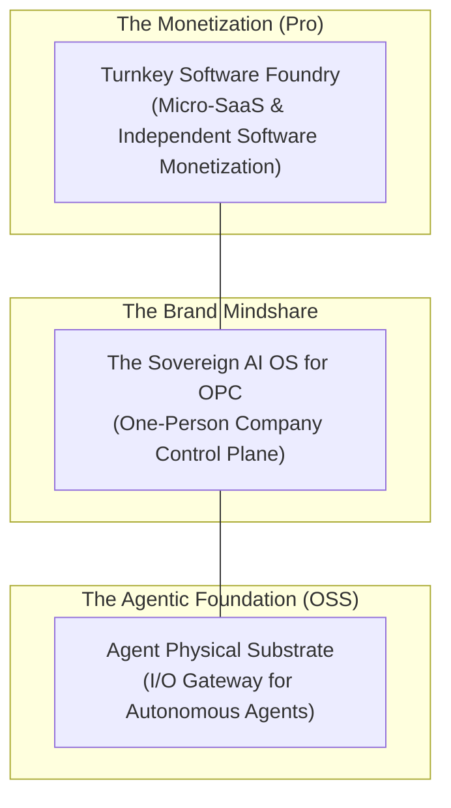

# BRAND-BASELINE (DRAFT)

> **Status**: DRAFT Baseline for PD-87 (Stage 1)  
> **Note**: Full README/README_ZH rewrite is deferred to PD-94 after Stage 2/3 code stabilizes. Do not sync these changes to public READMEs yet.

## 1. Hero Slogan & Positioning

**EN**: The Sovereign AI Operating System for One-Person Companies & Bare-Metal Substrate for Autonomous Agents.  
**ZH**: 一人公司主权 AI 操作系统 · 智能体连接真实世界的物理基石。

---

## 2. Three-Layer Architecture

### Layer Definitions

1.  **Monetization-Pro (Top)**: A turnkey foundry for developers to package AI ideas into commercial products with global billing and licensing.
2.  **Brand (Middle)**: The core identity. A self-hosted Go binary that replaces 10+ fragmented SaaS subscriptions with a single sovereign control plane.
3.  **Agentic Foundation-OSS (Bottom)**: The "body" for AI agents. Provides the physical and network substrate (Hands, Feet, Identity) for agents to interact with the real world.

---

## 3. Strategic Alignment

- **Sovereignty**: Focus on self-hosting and absolute control of data/assets.
- **Agent-First**: Every feature follows the Trinity Interface Law (UI, API, and MCP Tool).
- **Zero-Bloat**: Single binary, SQLite by default, no mandatory external dependencies.
