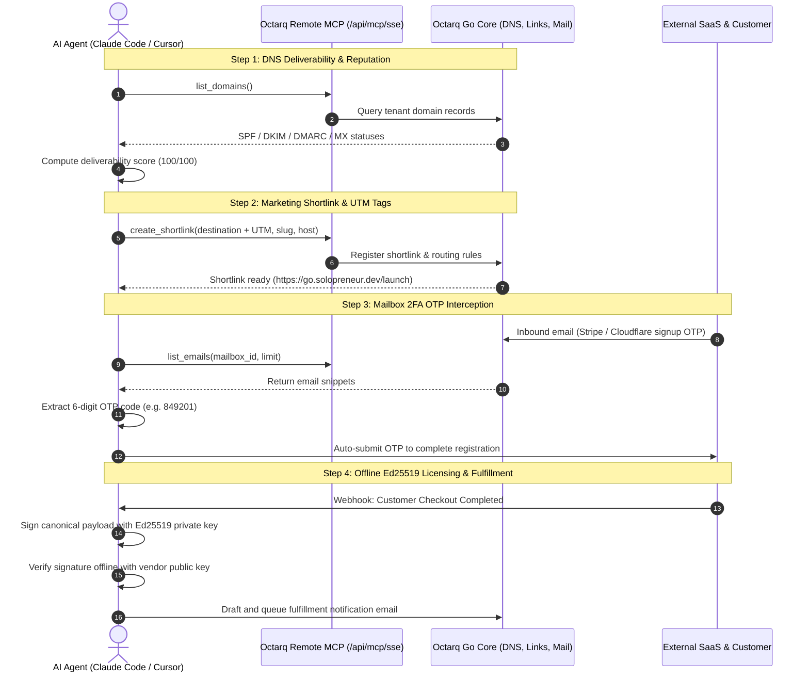

# 🤖 Autonomous Solopreneur Blueprint (一人公司自运行智能体样板间)

> **Unattended one-person company business operations driven by AI Coding Agents (Claude Code, Cursor, Windsurf) over Octarq Remote MCP.**

[](https://modelcontextprotocol.io)
[](https://ed25519.cr.yp.to/)
[](#)
[](#)

---

## 📖 Overview

Octarq is designed as the self-hosted operations backend and operational hub for the AI Agent era.

This **Autonomous Solopreneur Blueprint** demonstrates how an AI Coding Agent (such as **Claude Code** or **Cursor**) connects to an Octarq instance via Remote Model Context Protocol (MCP) and executes the **four mission-critical workflows** of a modern software solopreneur completely unattended:

1. **🌐 Automated DNS & Deliverability Audit**: Detects domain reputation, MX routing, and SPF/DKIM/DMARC anti-spoofing configurations over MCP (`list_domains`).
2. **🔗 Branded Subdomain & Marketing Shortlinks**: Provisions branded short links (`go.solopreneur.dev/...`) with UTM attribution tags via MCP declarative endpoint (`create_shortlink`).
3. **📬 Business Mailbox Listener & Automated 2FA OTP Interception**: Monitors dedicated business mailboxes (`list_mailboxes`, `list_emails`), intercepting external SaaS verification emails and parsing OTP codes via regex to complete account registrations autonomously.
4. **🔑 Offline Ed25519 License Minting & Customer Dispatch**: Simulates checkout completion, mints cryptographically signed offline Ed25519 licenses (`OCTARQ-LIC-v1...`), verifies them locally without network dependencies, and drafts fulfillment emails.

---

## 🏛 Architecture & Interaction Flow



---

## 🚀 Quickstart in 60 Seconds

The scaffold is built with pure Node.js (native `crypto`, `fetch`, `node:test`) and requires **zero external npm dependencies**.

### 1. Instant Run (Auto Mode)

Clone this repository and run the end-to-end pipeline:

```bash
cd examples/autonomous-solopreneur
node scripts/run-all.mjs
```

> **Simulation Mode**: If no local Octarq instance is currently active, the scaffold automatically switches to the built-in mock MCP server so you can experience the complete interactive workflow immediately.

### 2. Live Run against Octarq Instance

Start Octarq backend locally:
```bash
# In another terminal:
cd server && OCTARQ_SECRET_KEY=dev OCTARQ_ADMIN_PASSWORD=dev go run .
```

Generate an API Token in the Octarq Dashboard (**Settings -> Personal Settings -> API Tokens**), then run:

```bash
export OCTARQ_URL=http://localhost:8080
export OCTARQ_TOKEN=oct_your_token_here

node scripts/run-all.mjs --live
```

---

## 💻 Connecting Claude Code & Cursor

### Claude Code Setup

Connect Claude Code to Octarq's Remote SSE endpoint:

```bash
claude mcp add --transport sse octarq http://localhost:8080/api/mcp/sse --header "Authorization: Bearer oct_your_api_token"
```

Once connected, Claude Code automatically discovers all Octarq tools (`list_domains`, `create_shortlink`, `list_links`, `list_mailboxes`, `list_emails`).

### Standard Slash Commands (in `CLAUDE.md`)

This blueprint includes predefined shortcuts ready to use inside Claude Code:

| Command | Action |
|---|---|
| `/check-dns [domain]` | Audits SPF, DKIM, DMARC, and MX records via MCP |
| `/add-link <url> [slug] [host]` | Provisions branded shortlink with UTM attribution tags |
| `/check-mail [mailbox_id]` | Monitors business mailbox and extracts OTP verification code |
| `/issue-license <email> <plan>` | Mints tamper-proof offline Ed25519 license and fulfillment draft |
| `/run-solopreneur` | Runs the full 4-step unattended solopreneur pipeline |

### Cursor IDE Setup

Cursor settings are pre-configured in `.cursor/mcp.json` and `.cursorrules`:

```json
{
  "mcpServers": {
    "octarq-remote": {
      "url": "http://localhost:8080/api/mcp/sse",
      "headers": {
        "Authorization": "Bearer oct_your_token_here"
      }
    }
  }
}
```

---

## 🔐 Deep Dive: Offline Ed25519 Licensing

Solopreneurs selling desktop apps, plugins, or self-hosted software need licensing that does **not** rely on central phone-home servers.

This blueprint implements **RFC 8032 Ed25519 Asymmetric Digital Signatures**:

1. **Key Generation**:
   Generates a 32-byte Ed25519 private key (kept secret by the vendor) and public key (embedded in the distributed software).
2. **Canonical JSON Payload**:
   Keys are deterministically sorted to guarantee identical bytes regardless of JSON serializer.
   ```json
   {
     "customer": { "email": "founder@enterprise.com", "name": "Alex Vance" },
     "expiresAt": null,
     "features": ["mcp_unlimited", "custom_subdomains", "unattended_ops"],
     "licenseId": "lic_9841abe0",
     "plan": "lifetime_enterprise",
     "seats": 10
   }
   ```
3. **Armored Token**:
   `OCTARQ-LIC-v1.<base64url(payload)>.<base64url(signature)>`
4. **100% Offline Local Verification**:
   The client software reads the token, splits the payload and signature, and calls `crypto.verify(null, canonicalData, publicKey, signature)`. If verified, the app unlocks immediately with **zero network latency** and **zero downtime risk**.

---

## 🧪 Testing

Run the included automated test suite (covering Ed25519 crypto, OTP regex engine, UTM builder, and simulated MCP integration):

```bash
node --test tests/solopreneur.test.mjs
```

Output:
```
✔ Ed25519 Licensing Cryptography (6 tests)
✔ Mailbox OTP Extractor (4 tests)
✔ Marketing Shortlink UTM Builder (1 test)
✔ DNS Deliverability Auditor (2 tests)
✔ Octarq MCP Client Simulation (1 test)
ℹ tests 14 | pass 14 | fail 0
```

---

## 📽 Terminal Interaction Preview

A recorded asciinema session is bundled under [`assets/terminal-demo.cast`](assets/terminal-demo.cast).

To replay the interactive session in your terminal:
```bash
npx asciinema play assets/terminal-demo.cast
```

```
╭─── Claude Code (v1.2.0) ──────────────────────────────────────────────────────╮
│ Connected to Remote MCP Server: octarq (http://localhost:8080/api/mcp/sse)    │
│ Active Tools: list_domains, create_shortlink, list_links, list_mailboxes...  │
╰───────────────────────────────────────────────────────────────────────────────╯

> /check-dns solopreneur.dev
Domain Deliverability & DNS Audit: solopreneur.dev (Score: 100/100)
SPF: PASS | DKIM: PASS | DMARC: PASS | MX: PASS

> /add-link https://solopreneur.dev/launch launch go.solopreneur.dev
✔ [SUCCESS] Branded Shortlink Provisioned: https://go.solopreneur.dev/launch

> /check-mail
✔ [SUCCESS] Intercepted Stripe OTP: 849201 -> Submitted to registration form.

> /issue-license founder@nextgen-ai.com lifetime_enterprise 10
✔ [SUCCESS] Minted Offline License: OCTARQ-LIC-v1.eyJsaWNlbnNlSWQi...
✔ [SUCCESS] Verified Offline Signature: VALID (0 network roundtrips)
```

---

## 📄 License

MIT © [Octarq Community](https://octarq.org)
