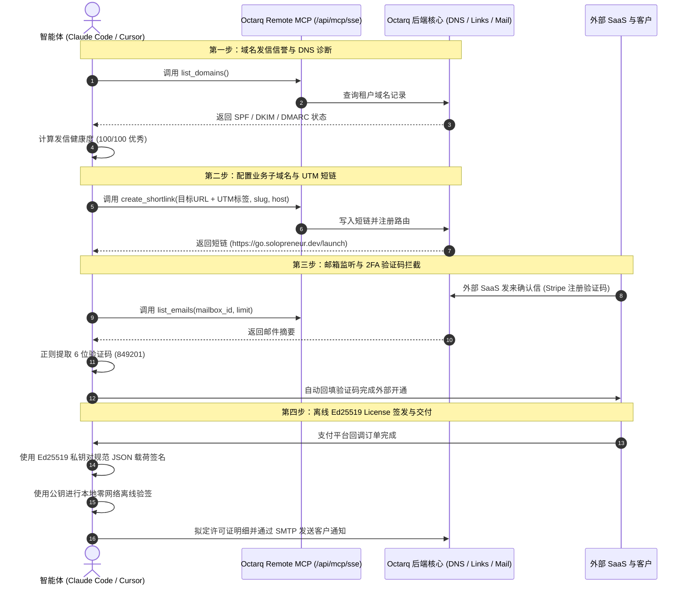

# 🤖 一人公司自运行智能体 (Autonomous Solopreneur) 官方开源 Blueprint

> **基于 Octarq Remote MCP，由 AI 编程智能体（Claude Code、Cursor、Windsurf）驱动的无人值守业务运维样板工程。**

[](https://modelcontextprotocol.io)
[](https://ed25519.cr.yp.to/)
[](#)
[](#)

---

## 📖 样板间定位与背景

Octarq 定位为**面向智能体时代的业务基础设施与运营中枢**。

本样板工程（Blueprint）专为**独立开发者、一人公司（Solopreneur）及 AI-Native 团队**打造，演示如何让智能体（如 Claude Code、Cursor）通过 Octarq 的 Remote MCP 端点（`/api/mcp/sse`）全面接管核心业务流程，实现无人值守自运行：

1. **🌐 自动化发信信誉与 DNS 巡检**：通过 MCP 实时检测域名 SPF、DKIM、DMARC 与 MX 解析，给出投递健康度评分（`list_domains`）。
2. **🔗 营销子域名与 UTM 追踪短链自动配置**：通过 MCP 声明式短链端点（`create_shortlink`）生成带归因参数的品牌短链接。
3. **📬 专属业务邮箱监听与 2FA 验证码自动提取**：监听业务收件箱（`list_mailboxes`、`list_emails`），当外部 SaaS（如 Stripe、Cloudflare）发来注册确认信时，智能体正则提取 6 位 OTP 并自动完成账号开通。
4. **🔑 离线 Ed25519 软件许可证签发与客户邮件通知**：模拟客户下单后，基于 RFC 8032 Ed25519 非对称加密签发防篡改离线 License，支持客户端本地零网络校验，并自动拟定交付通知信。

---

## 🏛 架构与交互时序图



---

## 🚀 60 秒快速上手体验

脚手架基于原生 Node.js（内置 `crypto`、`fetch`、`node:test`），**无需安装任何第三方 npm 依赖**。

### 1. 一键运行全流程（自带模拟模式）

克隆代码库后直接进入目录运行：

```bash
cd examples/autonomous-solopreneur
node scripts/run-all.mjs
```

> **自动模拟（Zero-Setup）**：若本地未启动 Octarq，脚本会自动启用内置的 Mock MCP 引擎，完整呈现智能体交互与控制台高亮效果。

### 2. 连接本地真实 Octarq 实例

在后台启动 Octarq：
```bash
cd server && OCTARQ_SECRET_KEY=dev OCTARQ_ADMIN_PASSWORD=dev go run .
```

在 Octarq 控制台（**个人设置 -> API 令牌**）生成一个 API Token，然后执行：

```bash
export OCTARQ_URL=http://localhost:8080
export OCTARQ_TOKEN=oct_你的API令牌

node scripts/run-all.mjs --live
```

---

## 💻 Claude Code 与 Cursor 接入指引

### Claude Code 接入

在终端中将 Octarq 的 Remote SSE 端点添加为 MCP 工具源：

```bash
claude mcp add --transport sse octarq http://localhost:8080/api/mcp/sse --header "Authorization: Bearer oct_你的API令牌"
```

### 预设命令（已配置在 `CLAUDE.md`）

进入本目录后，你可以直接向 Claude Code 发送预设斜杠指令：

| 指令 | 行为 | 对应脚本 |
|---|---|---|
| `/check-dns [domain]` | 检测域名 SPF、DKIM、DMARC 与 MX 记录并输出健康分 | `node scripts/step1-check-dns.mjs` |
| `/add-link <url> [slug] [host]` | 自动附加 UTM 营销参数并生成品牌短链 | `node scripts/step2-create-shortlink.mjs` |
| `/check-mail [mailbox_id]` | 扫描专属业务邮箱并自动提取最新 6 位 OTP 验证码 | `node scripts/step3-mail-otp-listener.mjs` |
| `/issue-license <email> <plan>` | 签发防篡改 Ed25519 离线许可证并拟定发货邮件 | `node scripts/step4-issue-license.mjs` |
| `/run-solopreneur` | 顺序执行上述 4 步无人值守完整运维流水线 | `node scripts/run-all.mjs` |

### Cursor IDE 接入

Cursor 配置已存放在 `.cursor/mcp.json` 与 `.cursorrules` 中：

```json
{
  "mcpServers": {
    "octarq-remote": {
      "url": "http://localhost:8080/api/mcp/sse",
      "headers": {
        "Authorization": "Bearer oct_你的API令牌"
      }
    }
  }
}
```

---

## 🔐 核心原理：Ed25519 离线数字签名授权

一人公司在销售桌面软件、离线插件或私有化部署产品时，往往不希望搭建繁琐且存在宕机风险的中央鉴权服务器。

本样板间使用 **RFC 8032 Ed25519 非对称加密算法** 实现零网络离线鉴权：

1. **私钥留存**：开发者持有 32 字节私钥，用于签名；
2. **公钥内置**：软件发行包内只嵌入 32 字节公钥；
3. **确定性载荷序列化（Canonical JSON）**：
   按字典序固定字段排列，防止不同语言 JSON 库产生签名歧义：
   ```json
   {
     "customer": { "email": "founder@enterprise.com", "name": "Alex Vance" },
     "expiresAt": null,
     "features": ["mcp_unlimited", "custom_subdomains", "unattended_ops"],
     "licenseId": "lic_9841abe0",
     "plan": "lifetime_enterprise",
     "seats": 10
   }
   ```
4. **信封格式**：
   `OCTARQ-LIC-v1.<base64url(payload)>.<base64url(signature)>`
5. **客户端零网络验签**：
   客户端接收到令牌后，拆分出载荷与签名，直接在本地调用 `crypto.verify(null, canonicalData, publicKey, signature)`。几毫秒内即可判断合法性与有效期，**彻底杜绝联网中断导致的功能误锁**。

---

## 🧪 自动化测试

运行内置测试套件（覆盖密码学验签、OTP 正则引擎、UTM 格式化及 MCP 交互）：

```bash
node --test tests/solopreneur.test.mjs
```

测试结果：
```
✔ Ed25519 Licensing Cryptography (6 tests)
✔ Mailbox OTP Extractor (4 tests)
✔ Marketing Shortlink UTM Builder (1 test)
✔ DNS Deliverability Auditor (2 tests)
✔ Octarq MCP Client Simulation (1 test)
ℹ tests 14 | pass 14 | fail 0
```

---

## 📽 终端交互回放展示

录制完整的交互记录位于 [`assets/terminal-demo.cast`](assets/terminal-demo.cast)。

如需在终端中回放体验：
```bash
npx asciinema play assets/terminal-demo.cast
```

---

## 📄 开源许可

[MIT](LICENSE) © [Octarq 社区](https://octarq.org)
